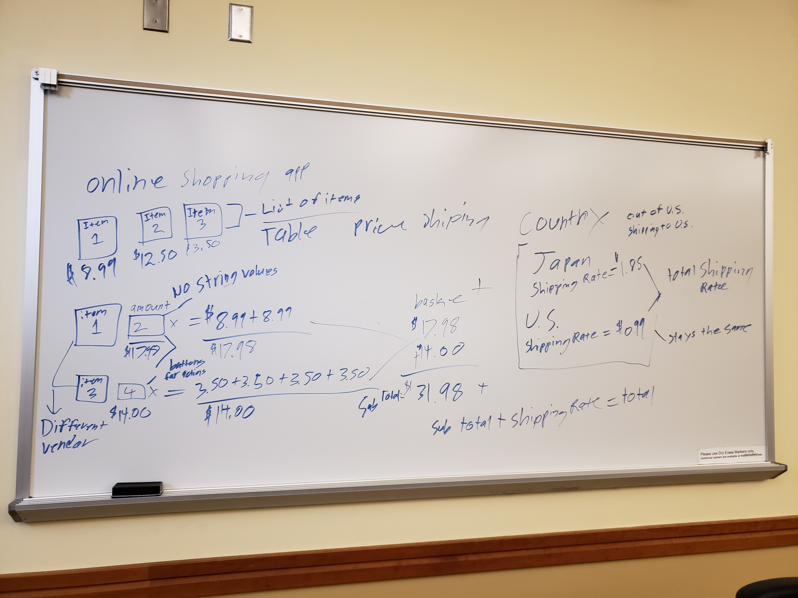

# Homework #2
## Using Javascript and Jquery

Here are the links to the Repository for my second project,<br>
Which is using both Javascript and Jquery in a html file.<br>

[Repository](https://github.com/Dakota808/Dakota808.github.io/tree/master/Project_2)<br/>
[Demo](https://dakota808.github.io/Project_2/index.html)<br/>
[Main Page](https://dakota808.github.io/)


## Gamers Paradise

<p>
This was no single simple task to do when I first was deciding on a project for this assignment. I had to think of the what I wanted to showcase the use of a calculation and design for it. So my thought was to build a clone of a amazon or ebay website.</p> <br>

## Html Page Design


## Javascript design


<p>
This process takes sometime to process in fact the design for it is much more simple. What it is basic inputs of integer type inputs which specifically prevent any string type inputs. From there we must build a event action handler to make sure that any input when exectued is sent to the javascript to then execute a simple calculation. This simple calculation which like most online shopping sties contain a static variable which is the price of the item, as well as the quanity of that particular item.</p> 

## HTML Code Design
Here is the desgin of the html file which will hold a event handler to wait for the calculation to take action.

``` html
<div class="row">
            <div class="col-md-2">
                <div class="item-List">
                    <div class="item">
                        <ul>
                            <li>
                                Item #1
                                <input type="number" placeholder ="Quanity" class="button" id="item1">
                                <button type="submit" id="button1" onclick="calculation(); return false">Buy</button>
                            <li>
                                Item #2
                                <input type="number" placeholder ="Quanity" class="button" id="item2">
                                <button type="submit" id="button2" onclick="calculation2(); return false">Buy</button>
                            </li>
                            <li>
                                Item #3
                                <input type="number" placeholder ="Quanity" class="button" id="item3">
                                <button type="submit" id="button2" onclick="calculation3(); return false;">Buy</button>
                            </li>

                        </ul>
                    </div>
                </div>
            </div>
```


The code for the jquery is just one simple line which you can copy and paste from any source that is using it.<br>
Here is the one I used for this project:<br>
```html
    <script src="https://ajax.googleapis.com/ajax/libs/jquery/3.3.1/jquery.min.js"></script>
    <script src="shopping.js" ></script>

```
### Note: This is placed in the html file

This whole design is used in simple of fucntions designed in javascript which in my thoughts is similar to Python.<br>
This is where all of the calculations are done or rather the actions are taking place.<br>

## Javascript and Jquery
<p>

This next part is quite simple as well which is the functions of the calculation and the setup of the Jquery. Lets first look at how to setup the query. There are two options that can be done to enable jquery, one is to download the file containing the jquery and then link that to the html page. This would be more reason able for many reasons. Or the alternative option in which you take the query and remote access those files. I chose to take the second and linked my html with an online link of the jquery. 

</p>

<p>
This code is using an id to indicate the action that needs to be taken when someone inputs a variable.
As well as using a button to make it an execuition. However, when you look at the on click which is the action that I take to build the table in a later discussion. However, the reason for the return false is to make sure that none of my data is going to be erased from previous actions that were taken, otherwise if that was not there it would wipeout all of the data that I had enplaced.  
</p>


``` javascript
function calculation(){
    var item1 = $("#item1").val();
    var itemOne = 3.50;
    var subtotal = item1 * itemOne;

   console.log("sub total = " + subtotal);
   $('#tableIn').append( "<tr><td>Item #1</td><td>$3.50</td><td>"+item1+"</td><td>$"+subtotal+"</td></tr>");
   console.log(subtotal);
}

function calculation2(){
    var item2 = $("#item2").val();
    var itemTwo = 7.99;
    var subtotal = item2 * itemTwo;
    console.log("sub total = " + subtotal);
    $('#tableIn').append( "<tr><td>Item #2</td><td>$7.99</td><td>"+item2+"</td><td>$"+subtotal+"</td></tr>");
    console.log(subtotal);

}

function calculation3(){
    var item3 = $("#item3").val();

    var itemThree = 8.99;

    var subtotal = item3 * itemThree;
    console.log("sub total = " + subtotal)
    $('#tableIn').append( "<tr><td>Item #3</td><td>$8.99</td><td>"+item3+"</td><td>$"+subtotal+"</td></tr>");
    console.log(subtotal);
}

```
<p>These are functions that take the static value of the item that the user selected and calculates the quanity to the price of the item. From there the code will send that information back to the html page where they will then print the data into the table. </p>

Here is the what the html file holds no values until the inputs are made from the javascript.
``` html
<!--This table holds all current items being bought from user.-->
        <!--This will update depending if the users changes his order.-->
            <div class="col-md-10">
                <div class="order_list">
                    <table style="100%" class="float-right">
                        <tr>
                            <th>Item</th>
                            <th>Price</th>
                            <th>Quanity</th>
                            <th id="test">Sub Total</th>
                            <tbody id="tableIn">

                            </tbody>
                        </tr>
                    </table>
                </div>
            </div>
        
```
One last thing to note from this is that all of this is done in the body of the html file.