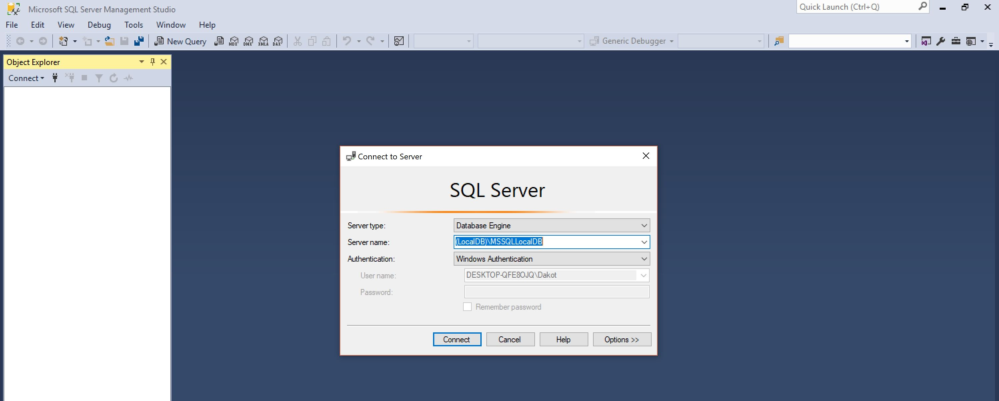
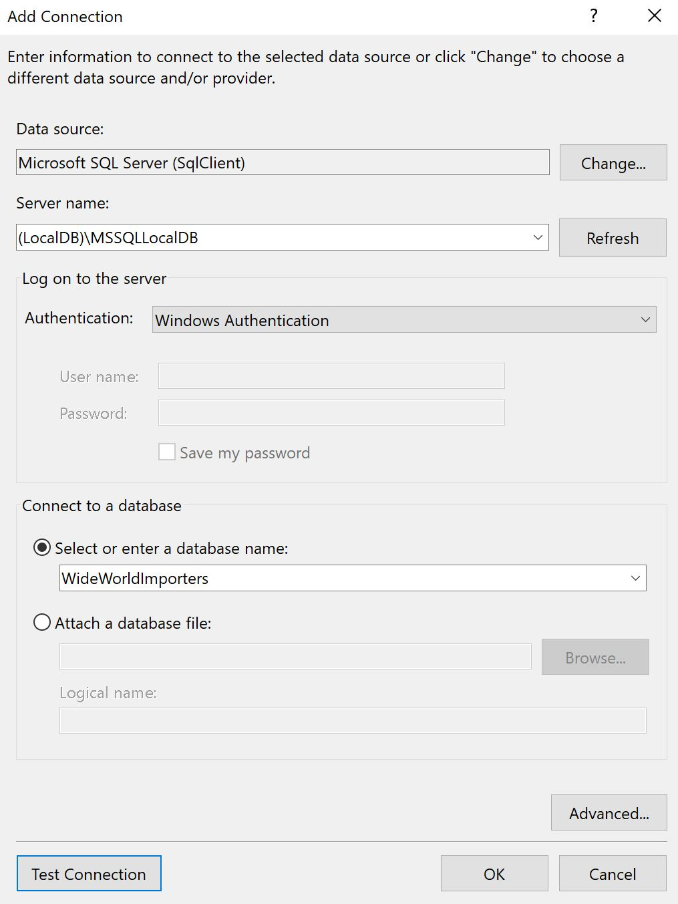
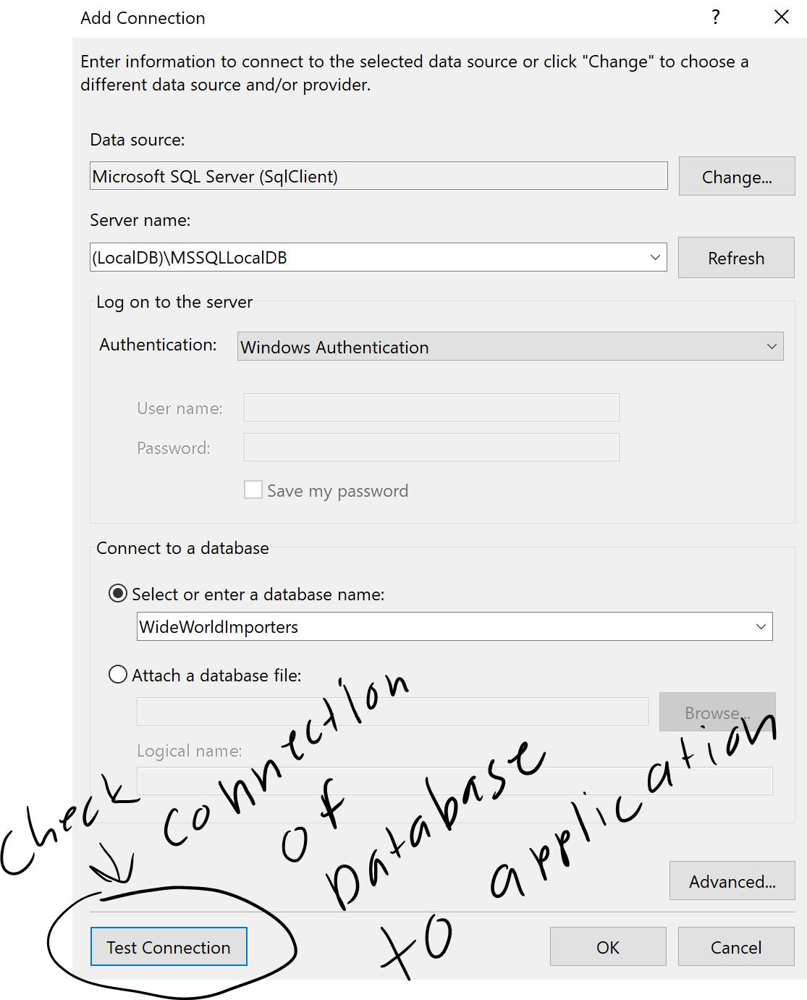

# Homework #6

## Multiple Databases using linked sql

<p>So working into more into detail from what we did in Homework 5 we are using the multi purpose database and trying to see if we can query from this database. This is getting us to understand more about how we query inside of a large database.</p>
<p>So we are using a worldwide importers database and trying different types of queries to get results back about certain things. We look at what stocks people are using and we also look into what the gross sales and gross profits are for certain individuals.</p>

Links to Assignment:<br>
[Main Page](https://dakota808.github.io/)<br>
[Repository](https://github.com/Dakota808/Dakota808.github.io/tree/master/Project_6/HW6/HW6)<br>
[Demo](https://www.youtube.com/watch?v=Zr9DuxAj5jw&feature=youtu.be)<br>

## Models

<p>Taking a look back on the idea of Models we can call from outside of visual studios by linking the database from outside of the program and running it through. Make sure that you are running however the sql management server application on your computer.</p>

## Sql Server connection
<p>This is one of the most key componets when you are trying to connect a server to visual studio. When you first open the sql managment server app, it will ask you the connection server as well as its server name and type. Take the server name of your database where it is going to be stored and loaded. From there take it back to visual studio and load it into the visual studio. select which database you would like to connect to the application and load that particular one. Make sure to test the connection to make sure that the database will connect. Once the connection is confirmed and you pressed "ok" the database should be connected to your appliaction along with all of tables that it holds.</p>

<br>
### Note: you can use the SQL management server to test differnet queries in the database just like any other sql service. 
<br>

<br>


<br>


<br>

<br>


## Building Feature one 
<p>
So when building the first feature of the application it is not so difficult once you understand the logic of it. Most of the setup is similar to Homework 5 where we build the DAL folder and the build a model folder and Context file to build the connection between the Database but instead we are giving it a linked sql where it will do a search of something and gives us back results. In this case we are looking up people and returning there information from the database.
</p>


### Controller
```CS
//Get: People/Users
        public ActionResult Index(string Search)
        {
            WWModelView vm = new WWModelView();
            if (Search == null || Search == "")
            {
                ViewBag.show = false;
                return View();

            }
            else
            {
                ViewBag.show = true;
                return View(db.People.Where(p => p.FullName.ToUpper().Contains(Search.ToUpper())).ToList());
            }
           
        }
```
## Note: this goes into the models and does a search of only the person we input into the search parameters.
<br>
This particular function can be done without using a model folder. However, we will use on in the second feature. <br>

## Feature Two

<p>
Build off of the feature one feature two will show not only the name of the search but as well as the profit and sales and the top 10 products that are being sold from this user. This is we use the inner folder in the models to handle all of the queries. </p>

### Detials of the user from controller
```CS
public ActionResult Details(int? id)
        {
            WWModelView vm = new WWModelView
            {
                MyPerson = db.People.Find(id)
            };
            ViewBag.IsP = false;

            if (vm.MyPerson.Customers2.Count() > 0)
            {
                ViewBag.IsP = true;
                int customerID = vm.MyPerson.Customers2.FirstOrDefault().CustomerID;
                vm.MyCustomer = db.Customers.Find(customerID);

                //Sums the Gross sales
                ViewBag.GrossSales = vm.MyCustomer.Orders.SelectMany(s => s.Invoices).SelectMany(p => p.InvoiceLines).Sum(x => x.ExtendedPrice);

                ViewBag.GrossProfit = vm.MyCustomer.Orders.SelectMany(s => s.Invoices).SelectMany(p => p.InvoiceLines).Sum(x => x.LineProfit);

                vm.MyInvoiceLine = vm.MyCustomer.Orders.SelectMany(y => y.Invoices)
                                                                   .SelectMany(z => z.InvoiceLines)
                                                                   .OrderByDescending(v => v.LineProfit)
                                                                   .Take(10)
                                                                   .ToList();

            }

            if(id == null)
            {
                return new HttpStatusCodeResult(HttpStatusCode.BadRequest);
            }
            Person myPerson = db.People.Find(id);
            if(myPerson == null)
            {
                return HttpNotFound();
            }
            return View("Details", vm);
        }
```

<p>
This does all of the queries and then displays them into the application. The inner folder in models allows us to query certain information without the use of multiple models being called into the program because in most cases some models have simliar connection to each other such as a name or location. This would cause issues to trying to query. So we built this inner folder to handle certain ones went want to use and have those connect to the other models in a sense.

</p>

### Inner folder of models called WWModelView

```CS
using System;
using System.Collections.Generic;
using System.Linq;
using System.Web;
using System.ComponentModel.DataAnnotations;

namespace HW6.Models.ViewModels
{
    public class WWModelView
    {
        public Person MyPerson { get; set; }

        public Customer MyCustomer { get; set; }

        public List<InvoiceLine> MyInvoiceLine { get; set; }
    }
}
```

## Anonymous objects in Views
<p>
One of the most important things to get from this assignment is the idea of how anonymous objects work in the View. So when we declare a object outside of a function we can call it the same name that we are trying to get from the database. For example, To display information @Html.DisplayNameFor(model => model.MyPerson.FullName). This works fine but when we build one inside of a fucntion then that is not the case. We need to call it a different to hold that information because we can't call information back if the data does not exist. Which is why we build another anonymous object to hold that information to make sure to connect to that particular database. 
</p>

### Html layout of table using razor:
```html
@*This is the information for all products sold by a someone*@
<div>
    <h3>Purchased Items</h3>
    <table>
        <thead>
            <tr>
                <th>
                    @Html.Label("stock-item", "Stock Item")
                </th>

                <th>
                    @Html.Label("description", "Description")
                </th>
                <th>
                    @Html.Label("line-profit", "Profit")
                </th>
                <th>
                    @Html.Label("sale-person", "Sales Person")
                </th>
            </tr>
        </thead>

        @foreach (var product in Model.MyInvoiceLine)
        {
            <tbody>
                <tr>
                    <td>
                        @Html.DisplayFor(item => product.StockItemID)
                    </td>

                    <td>
                        @Html.DisplayFor(item => product.Description)
                    </td>

                    <td>
                        @string.Format("{0:C}", product.LineProfit)
                    </td>

                    <td>
                        @Html.DisplayFor(item => product.Invoice.Person4.FullName)
                    </td>
                </tr>
            </tbody>


        }


    </table>
</div>
```
<br>

<p>
This assignment touched a lot of new things that are important to understand razor functions and the usages of linked sql queries. But for extra bonus to this was the way to setup the map. So for the extra credit part of this assignment we made a map to display the location of a particular search we do and display it.  So I got at least got the conncept of using this fucntion such as the use of a section. This is designed to setup the application to display the map and have it handle the code as referecne to the layout page of the application. </p>

### Using the map display
```html
@section Header
{
    <link rel="stylesheet" href="https://unpkg.com/leaflet@1.3.4/dist/leaflet.css"
         integrity="sha512-puBpdR0798OZvTTbP4A8Ix/l+A4dHDD0DGqYW6RQ+9jxkRFclaxxQb/SJAWZfWAkuyeQUytO7+7N4QKrDh+drA=="
         crossorigin="" />

     <!-- Make sure you put this AFTER Leaflet's CSS -->
    <script src="https://unpkg.com/leaflet@1.3.4/dist/leaflet.js"
        integrity="sha512-nMMmRyTVoLYqjP9hrbed9S+FzjZHW5gY1TWCHA5ckwXZBadntCNs8kEqAWdrb9O7rxbCaA4lKTIWjDXZxflOcA=="
        crossorigin=""></script>
}

    <div id="map" style="height: 180px"></div>
    <script>
        var long = @Model.MyCustomer.DeliveryLocation.Longitude
        var lat = @Model.MyCustomer.DeliveryLocation.Latitude
        var map = L.map('map').setView([lat, long ], 13);

        L.tileLayer('https://{s}.tile.openstreetmap.org/{z}/{x}/{y}.png', {
            attribution: '&copy; <a href="https://www.openstreetmap.org/copyright">OpenStreetMap</a> contributors'
        }).addTo(map);

        L.marker([51.5, -0.09]).addTo(map)
            .bindPopup('A pretty CSS3 popup.<br> Easily customizable.')
            .openPopup();
    </script>
```
<br>

### Layout page
```html
    @RenderSection("Header", required:false )
```
<br>
This is the connection string to layout the section of the map.<br>

These are what I got out of this assignment. Understanding the use of the Views a little bit more, How linked sql queries are designed and how they are handle in sql is different to what we are using to an extent. For example, "SelectMany()" is the similar to "Select *" in sql. Also understanding of having view model folders inside of the models. For full example take a look at the full demo of the application at the top of this page.  