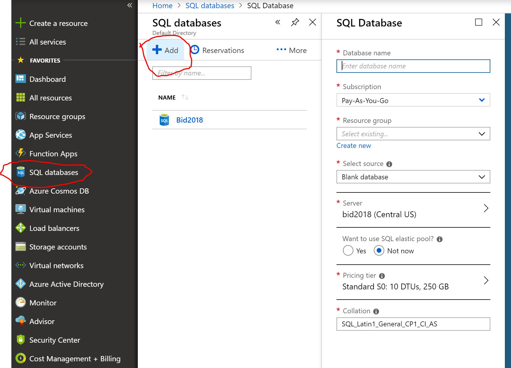
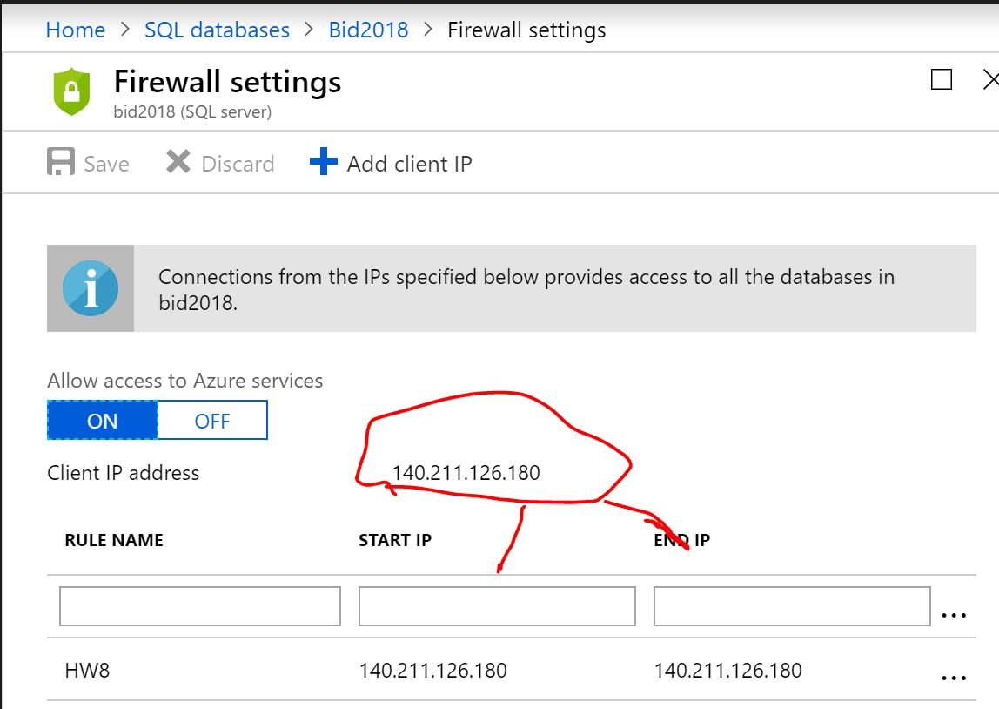
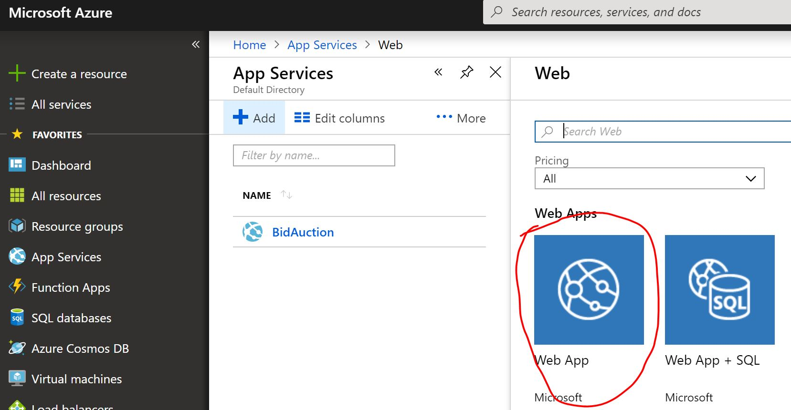
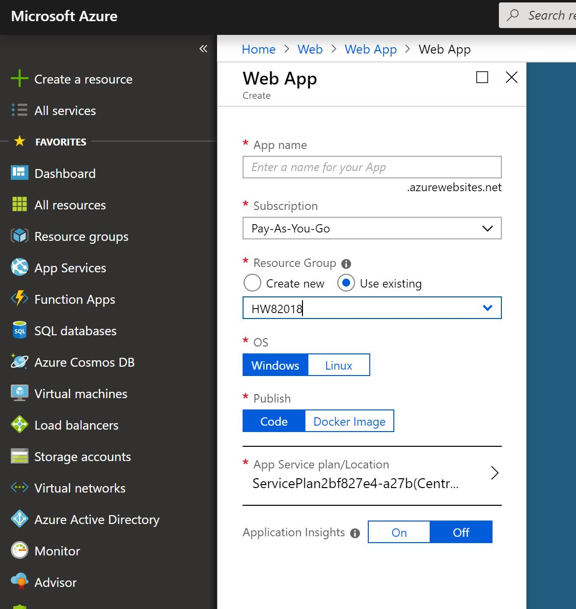
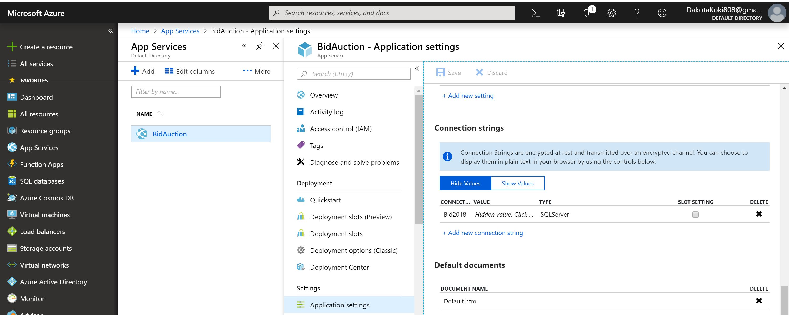
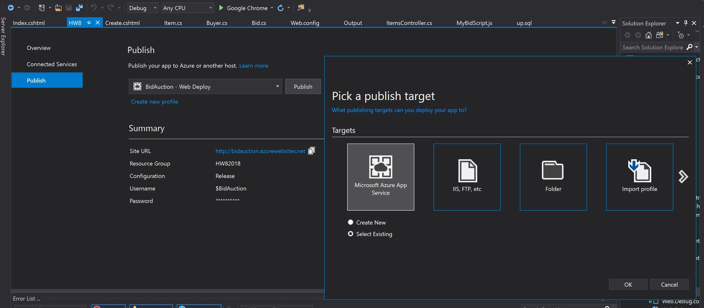
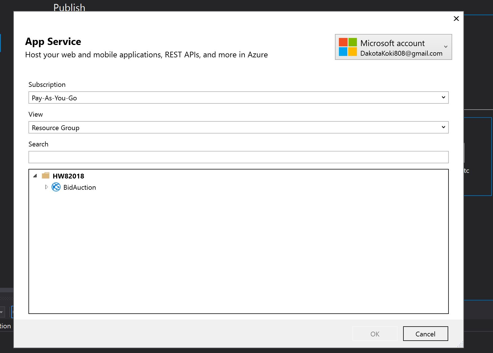

# Homework #9 
## Deploying onto Azure
 
## How to setup SQL Database 
 
1. set up the Resource Group on Azure by using add.  

 
2. Then once you created the Resource group you then build the SQL Database.  

 
3. After that you then need to go into your SQL Database you made and go and copy the connection String for this Database from Azure and place that connection String into your Web.config file in your appliaction which is metioned later. 
4. You also need to add the set Firewall settings in your SQL Database you built. This will allow access to the SQL Database on Azure. 

 
5. Then take the connection string from you azure database and place it inside of the web config file of the application the will contain the server name an password to gain access to that database on Azure. 

 

After All is setup the next part is to Build the database on azure and publish. Which is done by building the sql script that you built and then publishing the app on the web server.

6. Go to Azure and create a App service and select the web app. 

 
7. Then you will create the web app and make sure the resource group is the one you built not a new one. So just choose existing Resource Group. 

 
8. After you build the app head to you web app and go to the application settings and scroll down until you see the connection Strings part. This where you will add the connection string you have for your visual studio web config. Make sure it has the server name and password and the Azure Database. 

Lay of the connection string is for this is as follows. 
Connect: Azures SQL Database  
Value: Actual Connection String 
Type: Set this as SQL Server 

 

Once you have that done the last part of this is to publish the app. But before you do that make sure the Azure database is running on visual studio to do this on Visual Studio go to SQL scrpits and add new connection to test to see if it responeds this goes for the down script as well.

 

9. Finally go to the build tool bar on Visual Studio and select publish, then create a new profile and make when you publish it is for Azure Web services. Then add your resoruce group and publish the app. 

 

 

Make sure you have microsoft account linked to Visual Studio. 
For a Brief run down of these steps take a look at this [Demo](https://youtu.be/w06EJm0qRik)

